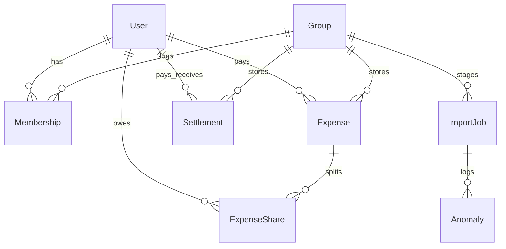

# Project Scope & Specifications: Shared Expenses App

This document outlines the validation rules, CSV parsing anomaly policies, and database schema implementation detail for the Shared Expenses App.

## Anomaly Detection & Handling Policy

Our import system validates CSV rows against 15 strict criteria. The engine uses three severity levels:
*   **ERROR**: Blocks row import. The row is skipped entirely.
*   **WARNING**: Flagged to the user. The row is modified automatically according to a predefined correction policy and imported.
*   **INFO**: Normalization logging. The row is imported, and minor formatting corrections (like casing/spaces) are logged.

| Rule # | Anomaly Type | Severity | Description | Action Taken / Handling Policy |
| :--- | :--- | :--- | :--- | :--- |
| 1 | `DUPLICATE_EXPENSE` | **WARNING** | Expense details (description, payer, date, amount) match another record. | Allowed import, but flagged to user to prevent double entries. |
| 2 | `MISSING_PAYER` | **ERROR** | Payer column is blank or refers to a name not in the system/group. | Skipped row import. |
| 3 | `MISSING_CURRENCY` | **WARNING** | Currency column is empty. | Assumed default group currency (INR) and logged. |
| 4 | `NEGATIVE_AMOUNT` | **ERROR** | Amount is less than 0. | Skipped row import. |
| 5 | `ZERO_AMOUNT` | **ERROR** | Amount is exactly 0. | Skipped row import. |
| 6 | `AMBIGUOUS_DATE` | **INFO** | Date format could be either DD/MM or MM/DD (both fields <= 12). | Checked file for definitive dates (day > 12) to deduce format, parsed, and logged assumption. |
| 7 | `INVALID_DATE` | **ERROR** | Date fails to parse or is in the future. | Skipped row import. |
| 8 | `NAME_NORMALIZATION` | **INFO** | Payer/split name has casing or suffix differences (e.g. "rohan" vs "Rohan"). | Normalized to group member's database name. |
| 9 | `SETTLEMENT_AS_EXPENSE` | **WARNING** | Expense represents a 1-to-1 repayment (e.g., description matches "settlement" or similar). | Imported record into the dedicated `Settlement` table instead of `Expense`. |
| 10 | `SPLIT_TYPE_MISMATCH` | **ERROR** / **WARNING** | CSV split values don't match the selected type, or splits are blank. | If blank, defaulted to equal split. If mathematically invalid, skipped row. |
| 11 | `PERCENTAGE_NOT_100` | **ERROR** | Splits under PERCENTAGE type do not sum to 100. | Skipped row import. |
| 12 | `INVALID_WEIGHTED_SPLIT`| **ERROR** | Split weights are negative or sum to 0. | Skipped row import. |
| 13 | `MEMBER_AFTER_LEAVING` | **ERROR** | Expense date is after member's leftAt date. | Skipped row import (e.g. Meera moving out in March). |
| 14 | `MEMBER_BEFORE_JOINING`| **ERROR** | Expense date is before member's joinedAt date. | Skipped row import (e.g. Sam moving in mid-April). |
| 15 | `CURRENCY_MISMATCH` | **ERROR** | Currency is not supported (only INR and USD). | Skipped row import. |

---

## Database Schema Design

We use PostgreSQL with Prisma ORM.

### Models & Rationale

1.  **User**: Holds auth credentials. Maps to expense payers and split participants.
2.  **Group**: Scope container for flatmates or trips.
3.  **Membership**: Core to historical tracking. Contains `joinedAt` and optional `leftAt`. Unique index on `[userId, groupId, joinedAt]` supports rejoining.
4.  **Expense**: Stores transaction header, total amounts, payer, original currencies, and converted INR amounts.
5.  **ExpenseShare**: Maps individual split allocations. Stores input split value and calculated INR debt portion.
6.  **Settlement**: Tracks debt repayments. Kept strictly distinct from expenses.
7.  **ExchangeRate**: Configures USD -> INR rates (with fallback default of 83.00).
8.  **ImportJob**: Stores file upload status, row count stats, and raw row JSON staged for import.
9.  **Anomaly**: Audit log showing validations warnings, reasons, and actions.
